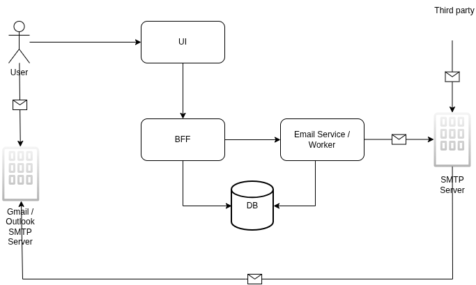

# Requirements
## Functional Requirements
### MVP
- As a User I should be able to sign up to the service, and the email should be verified
- As a User, I should be able to login to the Dashboard of the service to manage the proxy identities
- As a User, I should be able to create proxy email addresses so that they are mapped to my actual email address
- As a User I should be able to delete/disable/enable/dissasociate my actual email address with any proxy email
- As the system, any communication received on users proxy email should be forwarded to their primaary email address
- The system should log the email actitvity
### Future scope
- Reply through alias
- Custom domain addresses
- Temporary emails
- Spam / leak detection
## Non functional requirements
- The emails received on proxy email addresses should immediately be forwarded to the actual email address
- Emails should not be lost
- Failed deliveries should be retried
- System should keep accepting emails even if parts of the system are unhealthy

# Design
## HLD
